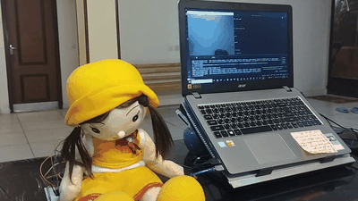

# Lernoro – AI/ML for Personalized Health Monitoring
**Project Status:** Early development / Patent pending

---

## Overview
Lernoro is a research project that applies AI and machine learning to healthcare, with a focus on monitoring neurological disorders such as Multiple Sclerosis (MS). The goal is to integrate clinical data, behavioral signals, and imaging data to develop predictive models for personalized patient care.

---

## Key Features
- Analysis of clinical and behavioral data (motion signals, hand movements, MRI scans)  
- AI-driven models for disease progression monitoring  
- Simulation tools for enhanced personalization and predictive accuracy  

> **Note:** The full implementation details are currently under patent consideration. Only non-sensitive documentation and public demonstrations are included here.

---

## Technologies
- Python, PyTorch, JAX  
- Data analysis and visualization tools  
- AI/ML modeling for healthcare applications  

---

## Hand Tremor Detection Demo
This GIF demonstrates the hand tremor detection system developed as part of the Lernoro project.  
The AI tracks finger movement in real time and visualizes possible tremor patterns.

**How it works:**  
1. The camera captures hand motion.  
2. Mediapipe detects hand landmarks and finger positions.  
3. The system calculates movement velocity and frequency.  
4. Possible tremor patterns are identified and visualized.  

> ✅ This is a simulation/demo. No patient data is used.

---

## Documentation
You can find example notebooks and visualizations that demonstrate the project's approach without revealing sensitive algorithms or patient data.

---

## Contact
For collaboration or further information, please contact:  
**fatemeh.orakshirani.mechatronics@gmail.com**
